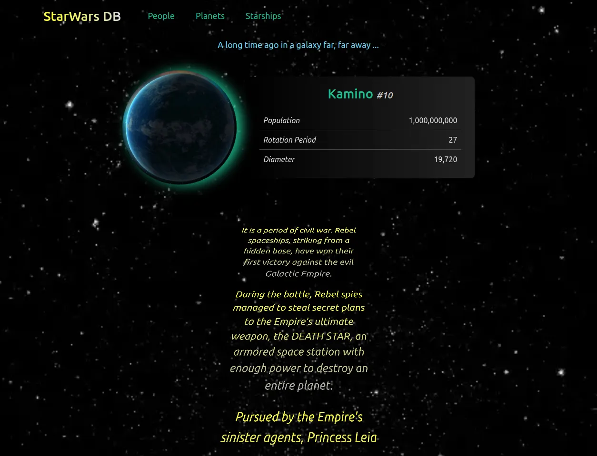
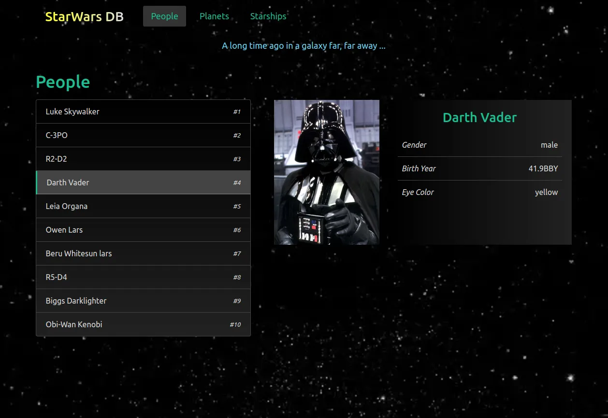

# React StarWars-DB app

> React training-project

## What I've learned

- Fetch API, Adapter
- State, Events
- Component Lifecycle
- Basic React patterns
- Basic React Router
- PropTypes
- Basic Hooks: useState, useEffect

## Next step

- add tests & TypeScript

---

## Previews

### Main Screen

### People Page

